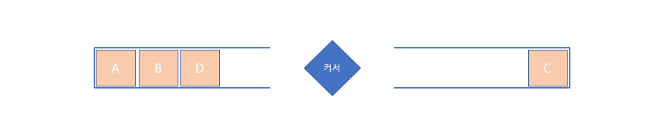

# :page_facing_up: 키로거 [백준 5397번]

:link: [[전체 소스 코드]](https://github.com/seungrokoh/Beakjoon_OnlineJudge/blob/master/%235397/5397.java)
:link: [[문제 풀러가기]](https://www.acmicpc.net/problem/5397)
***

__문제는 스택(Stack) 또는 링크드리스트(LinkedList)를 활용하여 문제를 해결할 수 있습니다.__ 해당 풀이는 **스택(Stack)을 활용하여** 문제를 풀어보겠습니다. 먼저 문제의 조건을 살펴보고 어떻게 문제에 접근해야 하는지 살펴보겠습니다.

# 문제 조건
문제에서 제시하는 **키로거는** 사용자가 입력하는 문자, 좌우 방향키, 백스페이스키로 구분되어 있습니다. 일반 에디터에서 글을 작성할 때와 동일하게 생각하시면 됩니다. 글을 입력하는 곳을 나타내는 **커서는** 방향키로 이동할 수 있으며 **해당 커서에 글을 입력하게 됩니다.** 만약, 글을 작성하다 **중간에 어떤 글자 또는 문구를 삽입하고 싶을 떄** 방향키로 해당 위치로 이동해 중간에 글을 작성하는걸 생각하시면 됩니다. 그리고 **글자를 지우고 싶을 때** 백스페이스키를 누르면 **현재 커서 위치의 글자를 지우게 됩니다.**

글자를 확인하는 방법은 쉽지만 **어떻게 현재 커서의 위치와 글자 입력을 처리하는가?** 이게 문제풀이의 핵심이라고 보시면 됩니다. **현재 커서를 나타내는 index 변수를 두고 처리하는 방법**이 있지만 해당 문제풀이는 조금 다르게 접근해보겠습니다.
***
# 문제 풀이
문제는 **스택(Stack)** 두 개를 활용하여 풀이하였습니다. 여기서 중요한 점은 **커서를 나타내는 변수를 따로 두지 않는다는 점입니다.** 두 스택을 **좌, 우로 배치하고 두 스택(Stack)의 중간 지점을 커서로 생각하여 커서의 움직임을 처리하였습니다.** 그림으로 나타내면 아래와 같습니다.



위 그림의 예제는 `ABC<D`의 입력을 처리한 뒤 양쪽 스택(Stack)의 모습입니다. 그림과 같이 **두 스택사이를 커서라고 생각하고 들어온 데이터를 양쪽 스택에 push, pop 합니다.** 문제에서 제시하는 각 문자의 기능을 상세히 나타내면 아래와 같습니다.

### '<' 처리
**왼쪽으로 1만큼 이동** 한다고 하면 현재 커서가 **두 스택(Stack)의 가운데 위치하고 있기 때문에** 왼쪽 스택(Stack)에 있는 데이터를 오른쪽 스택(Stack)으로 옮긴다. **이때 왼쪽 스택(Stack)이 비어있는지 확인 후 비어있지 않을 때에만 데이터를 이동시킨다.**

### '>' 처리
**오른쪽으로 1만큼 이동** 한다고 하면 현재 커서가 **두 스택(Stack)의 가운데 위치하고 있기 때문에** 오른쪽 스택(Stack)에 있는 데이터를 왼쪽 스택(Stack)으로 옮긴다. **이때 오른쪽 스택(Stack)이 비어있는지 확인 후 비어있지 않을 떄에만 데이터를 이동시킨다.**

### '-' 처리
**현재 커서위치 앞에 있는 데이터를 지우는 연산을** 하므로 **왼쪽 스택(Stack)의 Top 데이터를 지운다** 이떄 **왼쪽 스택(Stack)이 비어있지 않은지 확인 후 비어있지 않을 때에만 데이터를 지운다.**

### 나머지 처리(글자입력)
글자가 입력되면 **커서의 위치가 두 스택(Stack)의 중간 위치이므로 왼쪽 스택(Stack)에 데이터를 넣는다.**

### 결과 출력
마지막으로 왼쪽 스택에 있는 값들은 **먼저 입력된 문자이므로 스택(Stack)의 가장 안쪽부터 차례대로 읽고**, 오른쪽 스택(Stack)에 있는 값들은 거꾸로(Stack의 최 상단부터) 읽으면 됩니다.

***
만약 **링크드리스트(LinkedList)를 이용해 문제를 해결한다면** 현재 커서의 위치를 나타내는 변수를 두고 LinkedList의 index로 접근해 데이터의 삽입 및 삭제 처리를 하면 해결할 수 있습니다.

스택(Stack)으로 풀이한 소스코드는 아래와 같습니다.


### __:seedling: main 함수__
문제의 조건을 입력받고 solve함수를 호출합니다.
```java
public static void main(String[] args) throws IOException {
        int testCase = Integer.parseInt(br.readLine());
        for (int i = 0; i < testCase; i++) {
            System.out.println(solve(br.readLine()));
        }
    }
```
### __:seedling: solve 함수__
입력된 키로거의 값을 풀어 사용자가 입력한 값을 반환하는 함수입니다.
```java
private static String solve(String input) {
        StringBuilder result = new StringBuilder();
        Stack<Character> left = new Stack<>();
        Stack<Character> right = new Stack<>();

        char[] password = input.toCharArray();

        for (char ch : password) {
            switch (ch) {
                case '<':
                    if (!left.isEmpty()) right.push(left.pop());
                    break;
                case '>':
                    if (!right.isEmpty()) left.push(right.pop());
                    break;
                case '-':
                    if (!left.isEmpty()) left.pop();
                    break;
                default:
                    left.push(ch);
            }
        }
        // 왼쪽 스택의 값 저장
        for (Character character : left) {
            result.append(character);
        }
        // 오른쪽 스택의 값 저장
        while(!right.isEmpty())
            result.append(right.pop());

        return result.toString();
    }
```

***
# __:bulb: Github에 더 많은 문제 풀이가 있습니다.__
[Programmers 문제 풀이 ](https://github.com/seungrokoh/TIL/Algorithm)

[BaekJoon Online Judge 문제 풀이](https://github.com/seungrokoh/Beakjoon_OnlineJudge)
